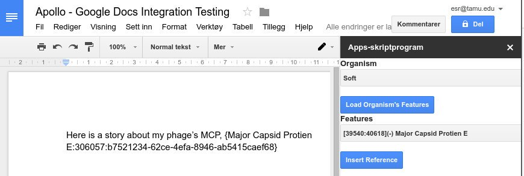

# Google Docs / Apollo Integration

Especially with phages, we experience the unique problem of having to reference
features in our genome during writing that may be in different places for
publication. The solution to this is obvious, write using persistent
identifiers like UUIDs, and then collapse those into non-persistent identifiers
tied to a specific revision of annotation during publication.

This is very much WIP and an experiment.

## LICENSE

AGPL-3.0
